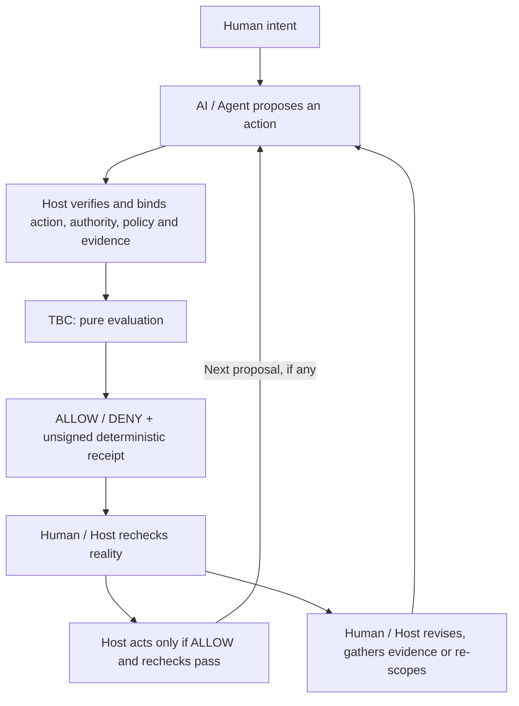

# Trust-Bounded Collaboration

[简体中文](README.zh-CN.md)

**One Human. Multiple AIs. Real work. Human meaning stays in command.**

**Trust-Bounded Collaboration (TBC) is an open practice and reference project for AI-native Individual Organizations.**

TBC explores how one person and multiple AI agents can operate as a real, long-lived working organization — across research, product, engineering, testing, release and operations — without letting growing AI capability silently take over Human goals, judgment or consequence authority.

**We treat powerful AI platforms as the floor, not the ceiling.**

We reuse mature models, runtimes, policy systems, cloud services and tools whenever they already solve the problem. TBC focuses on what remains above that floor: Human meaning, collaboration structure, authority, coordination, correction and learning.

This project comes from real Human-AI project practice, not a speculative framework. Its executable components are reference mechanisms extracted from those experiences.
The current exact-action authority / policy / evidence evaluator is one such executable mechanism. **It is not the whole project, and it is not the reason TBC ultimately exists.**

Read the [vNext positioning, capability map and five field cases](https://github.com/andrew199799/trust-bounded-collaboration/blob/main/docs/vnext-positioning.zh-en.md), or try the [1.0 evaluator](#quick-start).

## What this organization is for

An AI-native Individual Organization is one Human working with multiple AI agents over time to perform work that traditionally required a small team across research, product, design, engineering, testing, release and operations.
It involves ongoing goals, division of work, handoffs, correction and shared learning, beyond simply using several AI tools. The Human defines success and retains final responsibility.

**What does the Human actually want? What counts as a correct outcome? How should Humans and AIs divide work, coordinate, authorize actions, recover from mistakes and learn together? As AI gains more cognitive and execution power, how do we keep that power aligned with Human meaning rather than allowing technical capability to redefine the goal?**

**Human meaning sovereignty means that AI may greatly expand cognition and execution, but the Human remains the authority for what matters, why it matters, what outcome is acceptable, and which consequences are worth taking.**

**Human-in-command, not Human-in-every-loop.** Authorized work can proceed without asking the Human to perform or approve every step. Changes to the goal or consequential scope return to the appropriate authority; local technical success cannot silently redefine the real goal.
Shared learning and organizational memory preserve decisions, corrections and their limits using existing tools; they do not turn an Agent's inference into a Human decision.

**Large platforms provide capability; Humans retain meaning.**

TBC does not compete with foundation models, Agent runtimes or orchestration, HITL UI or pause/resume, IAM or OAuth, policy engines, cloud, browser, memory or tool infrastructure, general SDLC or universal governance platforms. These are the platform floor to reuse.

**TBC is not trying to become the platform beneath every Human-AI organization. It is trying to understand and improve how those organizations actually work on top of increasingly capable platforms.**

## Practice basis

In our field practice, one Human and multiple AI collaborators have already worked together across a full real software product lifecycle, from product definition and design through engineering, testing, release and operations. This TBC repository is itself a Human + ChatGPT + Codex collaboration.

The underlying project evidence is not disclosed in this public repository. This is a bounded first-party field-practice claim, not independent validation or universal proof.

## From real work to a small mechanism

TBC grows from real Human-AI project practice. We extract collaboration problems that repeatedly appear in real work, turn validated principles into public cases and mechanisms, and implement code only where executable boundaries materially help.
Here, validation is bounded by the available practice and evidence; it is not universal validation or a production guarantee.

```text
real collaboration failure
→ reusable collaboration problem
→ reusable principle
→ reuse existing platform capability where sufficient
→ otherwise add the smallest executable boundary
→ return to real project use for validation
```

One recurring failure was authorization drift: a Human approved action A, but the Agent later prepared action B while earlier approval still appeared valid. TBC 1.0 turned that collaboration principle into a deterministic exact-action binding mechanism.

This is one example of how TBC works: **real collaboration failure → reusable principle → executable boundary where useful.** The host (the adopting application) verifies facts and enforces decisions. The evaluator does not determine whether the product meets the Human's real goal.

## Make collaboration drift observable

A changed proposal, expired approval or missing check can otherwise remain hidden
behind a simple “ready” status. TBC turns mismatches in the supplied facts into
specific evaluation signals that a developer can use to locate the affected step.

| Problem | Signal from current 1.0 | Typical Human/host response |
| --- | --- | --- |
| Action or revision changed, but approval still refers to the earlier proposal. | DENY with an action or policy binding mismatch. | Confirm the intended action and obtain verified authority, policy and evidence for that exact revision. |
| Authority is missing or no longer current. | DENY with missing or not-current authority. | Obtain valid exact-action authorization; credentials alone do not fill the gap. |
| Policy is stale, bound to another action or denies this action. | DENY with policy freshness, binding or explicit-denial reasons. | Recheck the applicable policy and revise the proposal/scope or seek an authorized policy decision. |
| Required evidence is missing, failed, stale or bound elsewhere. | DENY with evidence presence, pass, freshness or binding reasons. | Gather and verify the required observations for this action before re-evaluation. |
| One consequential step is blocked while independent safe work is available. | One evaluation returns DENY; a separate evaluation can return ALLOW. Each receipt names its `affected_transition`. | Hold the blocked step; evaluate independent work against its own authority and facts. |
| An ALLOW/DENY result is hard to trace. | The receipt records the decision, denial reasons, action/context digests, time and affected transition. | Inspect the bound inputs and reasons; recheck reality before acting. ALLOW has an empty denial-reason list. |

Required evidence is checked only under a current, exact-action-bound ALLOW Policy.
These signals describe the supplied facts; the host verifies their connection to reality.
The practical loop is: expose a mismatch or gap, localize the affected transition,
revise the action/authority/policy/evidence/scope, then re-evaluate. Independent safe
work can continue where its own evaluation and host checks permit.

## Bounded collaboration and continuous correction



Each pass is a bounded evaluation, not an autonomous correction engine. TBC
provides the checkpoint and bindings; Human/host/project logic owns intent, fact
verification, policy, correction choices and real enforcement. TBC does not
correct an Agent automatically or dynamically rewrite policy. A revised proposal
needs fresh evaluation; an earlier ALLOW is not a reusable execution token.

Do not confuse persistence with progress. Repeated non-convergence or oscillating
fixes are a routing signal for Human/host/project logic: check for a task-definition
mismatch (overbroad, ambiguous or conflicting scope/acceptance), a task-structure
mismatch (distinct capabilities bundled into one task), or an Agent-capability
mismatch (model, tooling or context poorly suited to the work). Check whether the
work is still converging; if not, reframe or split it and tighten acceptance. If the
mismatch persists, route it to a better-suited Agent instead of blindly retrying.
These are Human/host correction choices: Core keeps no retry history, scores no
Agent capability and does not automatically select another Agent.

## The 1.0 evaluator mechanism

Current 1.0 implements that checkpoint as a small Python library that checks
whether verified authority, policy and evidence apply to **one exact proposed
action**. For example, an Agent may have valid credentials, a Human approval and
passing tests, but propose a different revision from the one approved. The earlier
facts must not silently authorize that changed action.

An action contains `actor`, `transition`, `resource` and a JSON-object `payload`.
Include the revision and other details that matter to the decision in that action.
`evaluate()` recomputes its SHA-256 digest and compares it with Context, Grant and
Policy bindings. Changing any action field invalidates facts bound to the old action.

Only a current, exact-action-bound ALLOW Policy supplies the required evidence IDs.
Each required observation must bind to that action, be marked passing by the host
and remain current at the explicit evaluation time. Well-formed facts that fail these
checks yield DENY; malformed inputs raise `InputError`. Missing authority is never
inferred from available credentials.

Our engineering principles are simple:

- Humans retain final consequence authority. Technical capability is not task
  authorization; a proposal is not permission to merge or release.
- Claims need bound evidence. Ambiguity fails closed; a blocked transition does
  not impose a global mission stop.
- Mechanisms stay generic and project policy stays with the host. Code, tests and
  runnable examples come before framework claims; receipts explain evaluation.

## Quick Start

From a checkout of this repository, using Python 3.11–3.14:

```sh
python3 -m venv .venv
. .venv/bin/activate
python -m pip install build==1.6.0
python -m build
python -m pip install --no-index --no-deps dist/*.whl
tbc demo repository --json
python -m tbc demo repository --json
```

On Windows, activate with `.venv\Scripts\activate` and pass the generated wheel
filename instead of the shell wildcard. These commands build/install locally; they
do not publish a package. Build tooling may download dependencies. Once installed,
the demo is offline and credential-free. Runtime dependencies: Python standard library only.

The repository demo prints `simulation=true`, named cases and `executed=false`
receipts. Expected DENY cases are successful demonstrations (exit 0); an unexpected
result exits 1 and invalid usage exits 2. The CLI is limited to help, version and
this fixed repository demo.

## Four runnable use cases

Run these from the checkout or unpacked source distribution after installing the wheel.
All are synthetic and offline; none performs the proposed action.

| Use case | Run | What to look for |
| --- | --- | --- |
| Repository authority | `python -m tbc demo repository --json` | Contributor proposal ALLOW; canonical main/tag/delete/non-fast-forward/merge/release DENY; independent inspection ALLOW. |
| Approval-bound consequential action | `python examples/approval_bound_action.py` | Approved deletion proposal ALLOW; missing approval or changed revision with old Grant DENY. No file is deleted. |
| Evidence-bound transition/release | `python examples/evidence_bound_transition.py` | Current bound facts ALLOW; missing/stale/failed/mismatched evidence DENY. Changed action invalidates old Policy/evidence. Nothing is released. |
| Scoped blocker and independent safe work | `python examples/scoped_blocker.py` | Consequential proposal DENY; separately authorized inspection ALLOW. Neither action executes. |

The [examples guide](examples/README.md) explains the fixtures and separates current
TBC examples from legacy v0.1 material. The [compact integration snippet](examples/tbc_integration.py)
is an additional four-function starting point: `python examples/tbc_integration.py`.

## Public API

| Function | Contract |
| --- | --- |
| `load_request(text)` | Parse and validate one `tbc.request.v1` request from JSON text. |
| `action_digest(action)` | Compute the exact action's domain-separated SHA-256 digest. |
| `evaluate(request, *, context)` | Validate host-owned `tbc.context.v1` facts and return a `tbc.receipt.v1` mapping with decision, reasons, action/context digests, time, affected transition and `executed=false`. |
| `dumps_receipt(receipt)` | Validate receipt structure and emit deterministic JSON text. |

`InputError` exposes a `code` and sanitized `path` for invalid input. These four
functions plus `InputError` are the public surface; example helpers/output wrappers
are not additional stable APIs or schemas.

## Integration responsibilities and boundaries

TBC supplies the pure evaluation and receipt contract. Your host supplies verified
facts and integrates the result with its own execution controls.

| Host responsibility | TBC check |
| --- | --- |
| Authenticate the actor and verify issuer/approver authority before constructing a Grant. | Actor equality, exact-action Grant binding and validity interval. |
| Establish policy and verify its required evidence. Never accept authority Context from an untrusted caller. | Exact-action Policy binding, ALLOW decision, required evidence IDs and observation binding/pass/freshness. |
| Supply time, encode all decision-relevant target details and decide which work is independent. | Explicit intervals and one evaluation scoped to the requested transition. |
| Recheck target identity/state/freshness at the real transition, handle replay and enforce the result. Sanitize and retain outputs appropriately. | Return an unsigned receipt; no execution, authentication or replay protection. |

`dumps_receipt` validates shape, not authenticity; hashes do not establish truth.
ALLOW is not an execution token or proof that an action happened. Reliable use rests
on the host's verified facts and enforcement. For capability placement and future
candidates, see the compact [capability disposition](docs/capability-disposition.md).

## Deterministic behavior and conformance

The same normalized action/context produces the same receipt bytes and digests.
Encoding uses `sort_keys=True`, `ensure_ascii=False`, `separators=(",", ":")`,
`allow_nan=False`, UTF-8, no BOM and no trailing newline. Keys must be strings;
floats, surrogates, duplicate JSON keys and integers outside ±(2^53−1) are rejected.
JSON null/bool/string/integer/list/object values are supported. Unicode is not normalized.

Evidence sorts by unique ID; Policy required IDs sort with duplicates rejected;
receipt reasons sort/deduplicate. Payload array order stays unchanged. Digests use
the ASCII `tbc.action.v1` or `tbc.context.v1` domain, one newline byte and encoded JSON.
No RFC 8785/in-toto/DSSE compliance is claimed. The initial 1 MiB/depth 32 limits are
implementation safety defaults, not authority rules.

```sh
python -m pip install -e . pytest==9.1.1 build==1.6.0
python -m pytest -q
python -m build
python tests/check_distribution.py
git diff --check
```

CPython 3.11–3.14 conformance covers golden bytes/digests, contract and example tests,
and the separate legacy regression suite (127 tests). CI builds wheel/sdist and runs
the shipped current examples against a clean offline wheel install outside the checkout.
The first-run check reports elapsed time against a ten-minute target.

## Project status, feedback and participation

The positioning direction is **vNext**; the executable repository contract remains **`1.0.0`**. The reviewed foundation and four runnable
use cases are merged on `main`. Tagging, GitHub Release and package publication are
separate Human-controlled steps. This version does not claim production readiness
for every adopting project. Historical `src/tbao/`, its tests and v0.1 docs
remain reference material outside the current distribution/API.

Practitioners building one-Human + multiple-AI organizations are invited to contribute real cases, failure modes, counterexamples, places where mature platforms already solve a TBC problem, and alternative organizational mechanisms through the existing repository:

- Share real-world collaboration failures, hard-to-express boundaries, missing
  observability, adoption friction and extension ideas in [GitHub Issues](https://github.com/andrew199799/trust-bounded-collaboration/issues), using public-safe examples.
- For code or documentation contributions, follow [fork → branch → test → PR](CONTRIBUTING.md).
- For security-sensitive reports, follow [SECURITY.md](SECURITY.md) to arrange a private channel before sharing details.

Human maintainers own merge, release and publication; AI Agents follow [AGENTS.md](AGENTS.md).
See [community conduct](CODE_OF_CONDUCT.md) and [unreleased changes](CHANGELOG.md).
Never post secrets or private-source material publicly.

Licensed under [MIT](LICENSE), with a Human copyright holder. The package vendors
no third-party code and has no third-party runtime dependencies; contributions must
preserve applicable attribution and license obligations. Built by Andrew with
ChatGPT and Codex as AI engineering collaborators. AI attribution does not imply
copyright ownership or organizational endorsement.

TBC's broader goal is **to help one Human use increasingly capable AI systems to achieve the effective capacity of a small organization while preserving Human meaning, judgment, authority and responsibility.**

**AI is raising the floor of what one person can do. TBC explores how Humans can use that rising floor to build richer, more capable and more individual organizations — without surrendering the meaning that makes those organizations worth building.**
