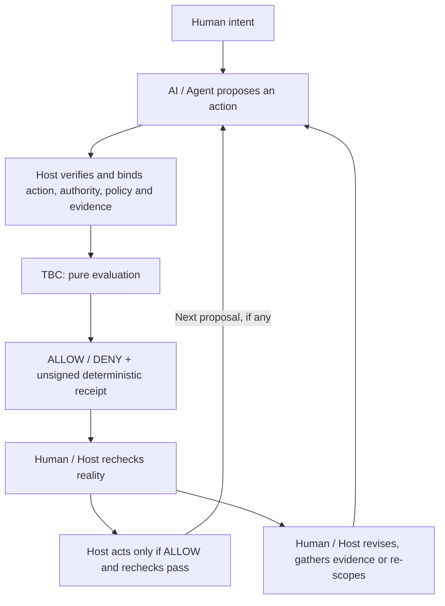

# Trust-Bounded Collaboration

TBC is a lightweight, code-first foundation for keeping Human–AI collaboration in
complex systems **bounded, observable and correctable**, even when models and Agents
are imperfect.

[简体中文](README.zh-CN.md)

**AI does not have to be perfect. Collaboration needs boundaries.**

## Why TBC exists

Human–AI collaboration cannot assume perfect understanding or execution. Different
models and Agents can misunderstand intent, hallucinate or behave differently as
context, tools, environment, service quality and available compute change. Those
uncertainties cannot be fully eliminated.

TBC's goal is to limit how far uncertainty and deviation can propagate into
uncontrolled consequences. It gives Humans and the adopting application (the
**host**) explicit checkpoints for reviewing proposed actions, stopping unsupported
steps and trying again with revised facts or scope:

- **Bounded:** the host can hold a consequential step when its authorization or
  required supporting facts are missing, stale, mismatched or negative.
- **Observable:** reproducible receipts make evaluation decisions and denial reasons
  inspectable; the Human/host still checks what is happening in the real system.
- **Correctable:** Humans and host logic can revise a proposal, gather evidence or
  re-scope work, then evaluate the next bounded action. Unrelated authorized work
  can remain independently evaluable.

This applies to Agent proposals, multi-agent work, CI gates, approval systems and
release decisions. TBC grew out of repeated real Human–AI engineering practice.
Its public code, conformance tests and runnable examples define what the current
implementation demonstrates; this is not a claim of universal validation or
production guarantees.

## Bounded collaboration and continuous correction



Each pass is a bounded evaluation, not an autonomous correction engine. TBC
provides the checkpoint and bindings; Human/host/project logic owns intent, fact
verification, policy, correction choices and real enforcement. TBC does not
correct an Agent automatically or dynamically rewrite policy. A revised proposal
needs fresh evaluation; an earlier ALLOW is not a reusable execution token.

## The 1.0 executable foundation

Current 1.0 implements that checkpoint as a small Python library that checks
whether verified authority, policy and evidence apply to **one exact proposed
action**. For example, an Agent may have valid credentials, a Human approval and
passing tests, but propose a different revision from the one approved. The earlier
facts must not silently authorize that changed action.

An action contains `actor`, `transition`, `resource` and a JSON-object `payload`.
Include the revision and other details that matter to the decision in that action.
`evaluate()` recomputes its SHA-256 digest and compares it with Context, Grant and
Policy bindings. Changing any action field invalidates facts bound to the old action.

Only a current, exact-action-bound ALLOW Policy supplies the required evidence IDs.
Each required observation must bind to that action, be marked passing by the host
and remain current at the explicit evaluation time. Well-formed facts that fail these
checks yield DENY; malformed inputs raise `InputError`. Missing authority is never
inferred from available credentials.

Our engineering principles are simple:

- Humans retain final consequence authority. Technical capability is not task
  authorization; a proposal is not permission to merge or release.
- Claims need bound evidence. Ambiguity fails closed; a blocked transition does
  not impose a global mission stop.
- Mechanisms stay generic and project policy stays with the host. Code, tests and
  runnable examples come before framework claims; receipts explain evaluation.

## Quick Start

From a checkout of this repository, using Python 3.11–3.14:

```sh
python3 -m venv .venv
. .venv/bin/activate
python -m pip install build==1.6.0
python -m build
python -m pip install --no-index --no-deps dist/*.whl
tbc demo repository --json
python -m tbc demo repository --json
```

On Windows, activate with `.venv\Scripts\activate` and pass the generated wheel
filename instead of the shell wildcard. These commands build/install locally; they
do not publish a package. Build tooling may download dependencies. Once installed,
the demo is offline and credential-free. Runtime dependencies: Python standard library only.

The repository demo prints `simulation=true`, named cases and `executed=false`
receipts. Expected DENY cases are successful demonstrations (exit 0); an unexpected
result exits 1 and invalid usage exits 2. The CLI is limited to help, version and
this fixed repository demo.

## Four runnable use cases

Run these from the checkout or unpacked source distribution after installing the wheel.
All are synthetic and offline; none performs the proposed action.

| Use case | Run | What to look for |
| --- | --- | --- |
| Repository authority | `python -m tbc demo repository --json` | Contributor proposal ALLOW; canonical main/tag/delete/non-fast-forward/merge/release DENY; independent inspection ALLOW. |
| Approval-bound consequential action | `python examples/approval_bound_action.py` | Approved deletion proposal ALLOW; missing approval or changed revision with old Grant DENY. No file is deleted. |
| Evidence-bound transition/release | `python examples/evidence_bound_transition.py` | Current bound facts ALLOW; missing/stale/failed/mismatched evidence DENY. Changed action invalidates old Policy/evidence. Nothing is released. |
| Scoped blocker and independent safe work | `python examples/scoped_blocker.py` | Consequential proposal DENY; separately authorized inspection ALLOW. Neither action executes. |

The [examples guide](examples/README.md) explains the fixtures and separates current
TBC examples from legacy v0.1 material. The [compact integration snippet](examples/tbc_integration.py)
is an additional four-function starting point: `python examples/tbc_integration.py`.

## Frozen public API

| Function | Contract |
| --- | --- |
| `load_request(text)` | Parse and validate one `tbc.request.v1` request from JSON text. |
| `action_digest(action)` | Compute the exact action's domain-separated SHA-256 digest. |
| `evaluate(request, *, context)` | Validate host-owned `tbc.context.v1` facts and return a `tbc.receipt.v1` mapping with decision, reasons, action/context digests, time, affected transition and `executed=false`. |
| `dumps_receipt(receipt)` | Validate receipt structure and emit deterministic JSON text. |

`InputError` exposes a `code` and sanitized `path` for invalid input. These four
functions plus `InputError` are the public surface; example helpers/output wrappers
are not additional stable APIs or schemas.

## What the host must own

TBC performs pure evaluation and serialization. It does not authenticate identities,
collect Human approval, verify external evidence, determine policy truth, observe a
live repository, execute actions or provide persistence/orchestration.

| Host responsibility | TBC check |
| --- | --- |
| Authenticate the actor and verify issuer/approver authority before constructing a Grant. | Actor equality, exact-action Grant binding and validity interval. |
| Establish policy and verify its required evidence. Never accept authority Context from an untrusted caller. | Exact-action Policy binding, ALLOW decision, required evidence IDs and observation binding/pass/freshness. |
| Supply time, encode all decision-relevant target details and decide which work is independent. | Explicit intervals and one evaluation scoped to the requested transition. |
| Recheck target identity/state/freshness at the real transition, handle replay and enforce the result. Sanitize and retain outputs appropriately. | Return an unsigned receipt; no execution, authentication or replay protection. |

Hashes do not establish truth. `dumps_receipt` validates shape, not authenticity.
ALLOW is not an execution token or proof that an action happened. TBC cannot protect
a host that fabricates trusted facts or ignores DENY.

See the compact [capability disposition](docs/capability-disposition.md) for the
boundary between current Core, project policy and future candidates. Risk scoring,
assumption workflows and automatic rule promotion are not implemented Core features.

## Deterministic receipts and conformance

The same normalized action/context produces the same receipt bytes and digests.
Encoding uses `sort_keys=True`, `ensure_ascii=False`, `separators=(",", ":")`,
`allow_nan=False`, UTF-8, no BOM and no trailing newline. Keys must be strings;
floats, surrogates, duplicate JSON keys and integers outside ±(2^53−1) are rejected.
JSON null/bool/string/integer/list/object values are supported. Unicode is not normalized.

Evidence sorts by unique ID; Policy required IDs sort with duplicates rejected;
receipt reasons sort/deduplicate. Payload array order stays unchanged. Digests use
the ASCII `tbc.action.v1` or `tbc.context.v1` domain, one newline byte and encoded JSON.
No RFC 8785/in-toto/DSSE compliance is claimed. The initial 1 MiB/depth 32 limits are
implementation safety defaults, not authority rules.

```sh
python -m pip install -e . pytest==9.1.1 build==1.6.0
python -m pytest -q
python -m build
python tests/check_distribution.py
git diff --check
```

CPython 3.11–3.14 conformance covers golden bytes/digests, contract and example tests,
and the separate legacy regression suite (127 tests). CI builds wheel/sdist and runs
the shipped current examples against a clean offline wheel install outside the checkout.
The first-run check reports elapsed time against a ten-minute target.

## Project status and participation

Development version: **`1.0.0a1`**. The reviewed foundation and four runnable use cases
are merged on `main`; this is pre-freeze publication preparation, not a production
readiness claim. No tagged release or package publication is announced. Historical
`src/tbao/`, its tests and v0.1 docs remain reference material outside the current distribution/API.

Contribute through [fork → branch → test → PR](CONTRIBUTING.md).
Human maintainers own merge, release and publication; AI Agents follow [AGENTS.md](AGENTS.md).
See [security reporting](SECURITY.md), [community conduct](CODE_OF_CONDUCT.md) and
[unreleased changes](CHANGELOG.md). Never post secrets or private-source material publicly.

Licensed under [MIT](LICENSE), with a Human copyright holder. The package vendors
no third-party code and has no third-party runtime dependencies; contributions must
preserve applicable attribution and license obligations. Built by Andrew with
ChatGPT and Codex as AI engineering collaborators. AI attribution does not imply
copyright ownership or organizational endorsement.
