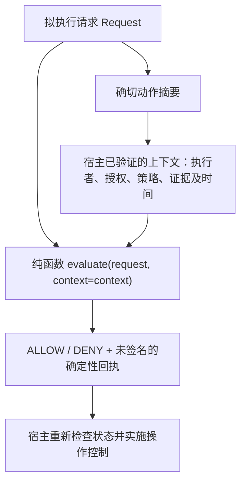

# Trust-Bounded Collaboration

一个小型 Python 库，用于检查已验证的权限、策略和证据是否适用于**同一个确切的拟执行动作**。

[English](README.md)

## 为什么需要 TBC

Agent 可能持有有效凭据、获得了人工批准、也通过了测试，却准备对另一个版本执行动作。
在人与 AI 的协作中，技术能力、任务授权、策略与证据会随着工作变化而脱节。
昨天通过检查的提案，不应悄悄成为今天另一个动作的授权。

TBC 为接入它的应用（下文称为**宿主**）提供统一的评估环节，可用于 Agent 提案、多 Agent 协作、CI 检查、审批系统和发布决策：

- 将执行者、授权事实（Grant）、策略（Policy）及必需证据（Evidence）绑定到拟执行动作。
- 对缺失、过期、不匹配或未通过的必需事实给出拒绝结果和明确原因。
- 输出可复现的回执，便于复核和排查问题。
- 当一个操作被阻塞时，仍可独立评估无关且已获授权的工作。

如果宿主已有验证事实的能力，但需要一个小而可测试的绑定检查契约，TBC 就可以承担这一环节。
可以直接从可运行示例开始，无需先学习治理框架，也不依赖特定 Agent 厂商。

## 工作机制



一个动作包含 `actor`、`transition`、`resource` 和 JSON 对象类型的 `payload`。
宿主应把版本等影响决策的细节写入动作。`evaluate()` 会重新计算其 SHA-256 摘要，
并与上下文、Grant 和 Policy 中的绑定比较。动作中任意字段发生变化，绑定到旧动作的事实就不再适用。

只有在有效期内、与确切动作绑定且决定为 ALLOW 的 Policy 才提供必需证据 ID。
每项必需证据必须绑定到该动作，由宿主标记为已通过，并在显式给定的评估时间仍然有效。
格式合法但检查不通过的事实得到 DENY；格式错误的输入抛出 `InputError`。
不会因为拥有技术凭据就推定缺失的任务授权。

我们遵循几条直接的工程原则：

- 人保留最终后果决定权。技术能力不等于任务授权，提交提案不等于获准合并或发布。
- 主张需要绑定的证据；存在歧义时不放行。阻塞一个操作，不代表整个任务全局停止。
- 通用机制留在库中，项目策略由宿主负责。代码、测试和可运行示例优先于框架主张；回执用于解释评估。

## 快速开始

在本仓库的检出目录中，使用 Python 3.11–3.14：

```sh
python3 -m venv .venv
. .venv/bin/activate
python -m pip install build==1.6.0
python -m build
python -m pip install --no-index --no-deps dist/*.whl
tbc demo repository --json
python -m tbc demo repository --json
```

Windows 下用 `.venv\Scripts\activate` 激活环境，并用实际生成的 wheel 文件名替代通配符。
这些命令只在本地构建和安装，不上传软件包。构建工具可能下载依赖；安装完成后的演示不需要网络或凭据。
运行时仅依赖 Python 标准库。

仓库演示输出 `simulation=true`、命名用例及 `executed=false` 回执。
预期中的 DENY 也属于演示成功（退出码 0）；结果不符合预期时退出码为 1，命令用法错误时为 2。
CLI 仅提供帮助、版本和这个固定仓库演示。

## 四个可运行用例

安装 wheel 后，在仓库检出目录或解压后的源码分发包中运行。
所有用例均使用合成事实、离线运行，不会实施拟执行动作。

| 用例 | 运行命令 | 观察结果 |
| --- | --- | --- |
| 仓库权限边界 | `python -m tbc demo repository --json` | 贡献者提案 ALLOW；对 canonical main、标签、删除、非快进、合并及发布的操作 DENY；独立检查 ALLOW。 |
| 批准绑定的后果性动作 | `python examples/approval_bound_action.py` | 已批准的删除提案 ALLOW；缺少批准或版本变化后沿用旧 Grant 时 DENY。不会删除文件。 |
| 证据绑定的操作与发布决策 | `python examples/evidence_bound_transition.py` | 当前且绑定正确的事实 ALLOW；证据缺失、过期、失败或错绑时 DENY。动作变化使旧 Policy／证据失效。不会发布任何内容。 |
| 局部阻塞与独立安全工作 | `python examples/scoped_blocker.py` | 后果性提案 DENY；独立获准的检查 ALLOW。两种动作都不会实际执行。 |

[示例指南](examples/README.md) 解释合成事实，并区分当前 TBC 示例与历史 v0.1 材料。
另有一个[四函数接入示例](examples/tbc_integration.py)，可运行 `python examples/tbc_integration.py`。

## 已冻结的公开 API

| 函数 | 契约 |
| --- | --- |
| `load_request(text)` | 从 JSON 文本解析并校验一个 `tbc.request.v1` 请求。 |
| `action_digest(action)` | 计算确切动作的、带域分隔的 SHA-256 摘要。 |
| `evaluate(request, *, context)` | 校验宿主持有的 `tbc.context.v1` 事实，返回 `tbc.receipt.v1` 映射，包含决定、原因、动作与上下文摘要、时间、受影响操作及 `executed=false`。 |
| `dumps_receipt(receipt)` | 校验回执结构并输出确定性 JSON 文本。 |

非法输入通过 `InputError` 提供 `code` 和已脱敏的 `path`。
公开接口仅为上述四个函数及 `InputError`；示例辅助函数和输出包装不构成新的稳定 API 或数据模式。

## 宿主必须负责什么

TBC 只进行纯评估和序列化。它不认证身份、不收集人工批准、不验证外部证据、不决定策略真伪、
不观察真实仓库、不执行动作，也不提供持久化或编排。

| 宿主责任 | TBC 检查 |
| --- | --- |
| 认证执行者，在构造 Grant 前验证授权者／批准者的权限。 | 执行者是否一致、Grant 是否绑定确切动作以及是否在有效期内。 |
| 确立策略并验证其必需证据；绝不从不可信调用者接收权限上下文。 | Policy 的确切动作绑定、ALLOW 决定、必需证据 ID 及证据的绑定、通过状态与时效。 |
| 提供时间，把影响决策的目标细节写入动作，并判断哪些工作相互独立。 | 显式时间区间，以及仅针对请求操作的一次评估。 |
| 在真实操作前重新检查目标身份、状态与时效，处理重放并实施控制；负责输出脱敏和保留。 | 返回未签名回执；不执行、不认证，也不提供重放保护。 |

哈希不能证明事实为真。`dumps_receipt` 校验的是结构，不是真实性。
ALLOW 不是执行令牌，也不是动作已经发生的证明。宿主若伪造可信事实或忽略 DENY，TBC 无法保护它。

简短的[能力归属说明](docs/capability-disposition.md) 区分当前核心、项目策略与未来候选能力。
风险评分、假设管理流程和自动规则晋升均不是已实现的核心功能。

## 确定性回执与一致性验证

相同的规范化动作和上下文产生相同的回执字节与摘要。
编码采用 `sort_keys=True`、`ensure_ascii=False`、`separators=(",", ":")`、`allow_nan=False`、
UTF-8，无 BOM、无末尾换行。键必须是字符串；拒绝浮点数、代理码点、重复 JSON 键和超出 ±(2^53−1) 的整数。
支持 JSON 的 null、布尔、字符串、整数、数组和对象；不进行 Unicode 规范化。

证据按唯一 ID 排序；Policy 必需 ID 排序且拒绝重复；回执原因排序并去重；payload 数组顺序保持不变。
摘要输入包含 ASCII 域 `tbc.action.v1` 或 `tbc.context.v1`、一个换行字节及编码后的 JSON。
不宣称符合 RFC 8785、in-toto 或 DSSE。初始 1 MiB／深度 32 限制是实现安全默认值，不是权限规则。

```sh
python -m pip install -e . pytest==9.1.1 build==1.6.0
python -m pytest -q
python -m build
python tests/check_distribution.py
git diff --check
```

CPython 3.11–3.14 一致性验证涵盖固定字节与摘要、契约和示例测试，以及独立的历史回归测试，共 127 项。
CI 构建 wheel／sdist，并在检出目录之外，用干净离线安装的 wheel 运行分发包中的当前示例。
首次运行检查会报告耗时，目标为十分钟以内。

## 项目状态与参与方式

开发版本为 **`1.0.0a1`**。已复核的基础实现和四个可运行用例已合入 `main`；
当前是在准备冻结前的公开内容复核，不代表已具备生产就绪条件。项目尚未宣布标签版本发布或软件包发布。
历史 `src/tbao/`、其测试及 v0.1 文档保留为参考材料，不属于当前分发包或 API。

通过 [fork → 分支 → 测试 → PR](CONTRIBUTING.md) 参与贡献。
人工维护者负责合并、版本发布及软件包发布；AI Agent 遵循 [AGENTS.md](AGENTS.md)。
另见[安全报告方式](SECURITY.md)、[社区行为准则](CODE_OF_CONDUCT.md)和[未发布变更](CHANGELOG.md)。
不要在公开渠道提交密钥或私有来源材料。

项目采用 [MIT 许可证](LICENSE)，版权主体为人。软件包未内置第三方代码，也没有第三方运行时依赖；
贡献须保留适用的署名和许可证义务。Andrew 与作为 AI 工程协作者的 ChatGPT、Codex 共同开展了项目工作。
AI 协作署名不意味着 AI 拥有版权，也不代表相关组织背书。
