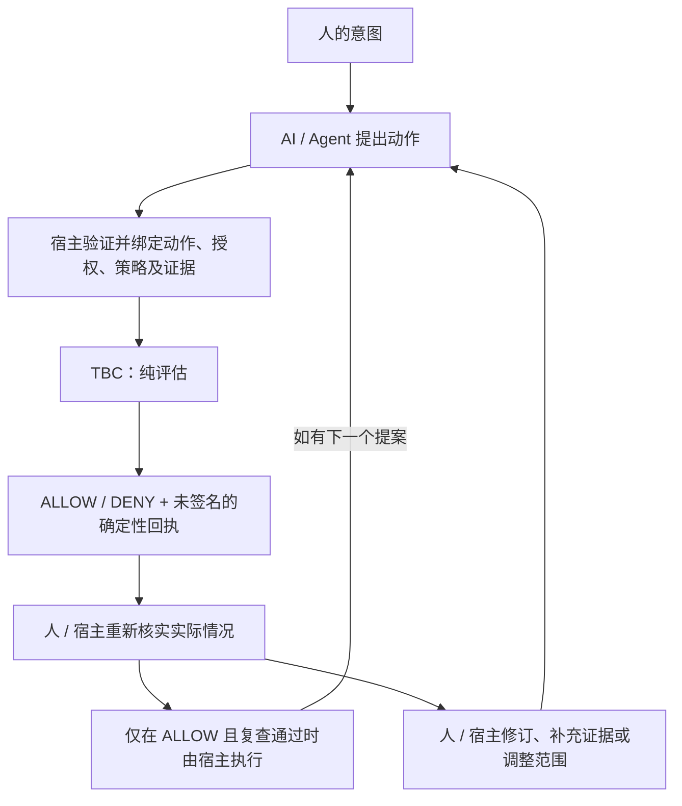

# Trust-Bounded Collaboration

[English](README.md)

**一个 Human，多个 AI，真正做事；人的意义始终拥有最终指挥权。**

**Trust-Bounded Collaboration（TBC）是一个面向 AI-native Individual Organization 的开放实践与参考项目。**

TBC 探索一个人和多个 AI Agent 如何长期组成一个真正能够工作的“小型组织”，共同完成研究、产品、工程、测试、发布和运营，同时避免越来越强的 AI 能力悄然取代人的目标、判断和最终后果权威。

**我们把强大的 AI 平台当作地板，而不是天花板。**

模型、Agent Runtime、Policy、云服务和成熟工具能复用就复用。TBC 关注的是地板之上的问题：人的意义、协作结构、分工、授权、协调、纠偏和共同学习。

TBC 来自真实 Human-AI 项目实践，而不是先写出来的一套理论。仓库中的代码，只是这些实践里已经值得固化的一部分机制。
当前的 exact-action authority / policy / evidence evaluator 只是其中一个已经被代码固化的机制，**它不是 TBC 的全部，也不是 TBC 存在的最终理由。**

阅读 [vNext 定位、能力图与五个实践案例](https://github.com/andrew199799/trust-bounded-collaboration/blob/main/docs/vnext-positioning.zh-en.md)，或[运行 1.0 评估器](#快速开始)。

## 这样的组织要解决什么问题

我们正在探索一个正在变成现实的新型组织：**一个 Human 与多个 AI Agent 长期协作，完成过去往往需要一个小团队承担的研究、产品、设计、工程、测试、发布和运营工作。**
这不只是“同时使用几个 AI 工具”：它需要持续的目标、分工、交接、纠偏与共同学习，由 Human 定义成功并承担最终责任。

**人想要什么？什么结果才算正确？AI 应该如何分工、协作、授权、纠偏和学习？当 AI 的认知与执行能力越来越强时，如何确保它始终服务于人的意义，而不是反过来让技术能力重新定义人的目标？**

**所谓人的意义主权，不是要求 Human 亲手执行每一步，而是无论 AI 的能力扩展到什么程度，什么事情值得做、为什么做、什么结果才算好、哪些后果可以接受，最终仍由 Human 决定。**

**Human-in-command, not Human-in-every-loop.** Human 掌握最终指挥权，不必亲自执行或逐步批准所有已授权工作。目标或后果范围发生变化时，应回到相应的决策权威；局部技术成功不能悄悄改写真正的目标。
共同学习与组织记忆借助现有工具保留决定、纠偏和适用边界，不能把 Agent 的推断变成人的决定。

**大平台负责能力，我们负责意义。**

TBC 不与大模型、Agent Runtime／编排、HITL 界面／暂停恢复、IAM／OAuth、Policy Engine、云、浏览器、记忆或工具基础设施、通用 SDLC 或通用治理平台竞争。这些是应优先复用的平台地板。

**TBC 不试图成为所有 Human-AI 组织脚下的新平台；它关注的是，当底层平台越来越强以后，这些组织究竟怎样才能真正运作得更好。**

## 实践基础

在真实软件产品实践中，一个 Human 与多个 AI 协作者已经共同走过产品定义、设计、工程、测试、发布与运营的完整周期。TBC 仓库本身也是 Human + ChatGPT + Codex 的协作产物。

底层项目证据不在本公开仓库披露。这是有明确范围的第一方实践陈述（bounded first-party field-practice claim），不是独立验证，也不是普遍证明。

## 从真实工作到最小机制

TBC 从真实 Human-AI 项目实践中提炼这些问题，把经过验证的协作原则转化为公开案例、可讨论的机制和必要的可执行参考实现。
这里的验证受已有实践与证据范围限制，不代表普遍验证，也不保证生产可靠性。

```text
真实失败
→ 发现组织问题
→ 形成原则
→ 成熟平台已有能力则直接复用
→ 仍有缺口时才做最小可执行固化
→ 回到真实项目继续验证
```

一个反复出现的失败是授权漂移：Human 批准了动作 A，Agent 后来却准备执行动作 B，而旧批准看起来仍然有效。TBC 1.0 将这条协作原则固化为确定性的确切动作绑定机制。

这只是 TBC 工作方式的一个例子：**真实协作失败 → 可复用原则 → 有必要时形成可执行边界。** 接入应用（下文称为**宿主**）验证事实并实施控制；评估器不会判断产品是否满足 Human 的真实目标。

## 将协作偏差显性化

一个简单的“已就绪”状态，可能掩盖提案已变、批准已过期或检查尚未完成的事实。
TBC 将输入事实中的不匹配转化为具体的评估信号，帮助开发者定位受影响的操作。

| 问题 | 当前 1.0 给出的信号 | 人或宿主的典型处理 |
| --- | --- | --- |
| 动作或版本已变化，批准仍指向旧提案。 | DENY，并指出动作或策略绑定不匹配。 | 确认拟执行动作，为这个确切版本取得已验证的授权、策略和证据。 |
| 授权缺失或已不在有效期内。 | DENY，并指出授权缺失或当前无效。 | 取得有效且绑定确切动作的授权；技术凭据不能填补这个缺口。 |
| Policy 过期、绑定到其他动作，或明确拒绝此动作。 | DENY，并给出策略时效、绑定或明确拒绝的原因。 | 重新核实适用策略，修改提案／范围，或寻求有权主体作出策略决定。 |
| 必需证据缺失、失败、过期或绑定到其他动作。 | DENY，并给出证据缺失、未通过、时效或绑定方面的原因。 | 为该动作收集并验证必需证据，再重新评估。 |
| 一个后果性操作受阻，但仍有独立安全工作可做。 | 一次评估返回 DENY，另一次独立评估可以返回 ALLOW；各回执通过 `affected_transition` 标明对应操作。 | 暂停受阻操作；依据独立工作的自身授权和事实分别评估。 |
| ALLOW／DENY 结果难以追溯。 | 回执记录决定、拒绝原因、动作与上下文摘要、时间及受影响操作。 | 查看绑定的输入和原因，行动前重新核实实际情况；ALLOW 的拒绝原因列表为空。 |

只有在 Policy 当前有效、绑定确切动作且决定为 ALLOW 时，才会检查必需证据。
这些信号描述的是输入事实，宿主负责验证它们与现实的对应关系。
实际处理路径是：显现不匹配或缺口，定位受影响操作，修订动作／授权／策略／证据／范围，然后重新评估。
独立安全工作在自身评估和宿主检查允许时仍可继续。

## 有边界的协作与持续纠偏



每一轮都是一次有边界的评估，并不存在自动纠偏引擎。
TBC 提供检查点和绑定；意图、事实验证、策略、纠偏选择和真实执行控制均由人、宿主或项目逻辑负责。
TBC 不会自动修正 Agent，也不会动态改写策略。修改后的提案必须重新评估，之前的 ALLOW 不是可复用的执行令牌。

反复尝试不等于取得进展。修订来回摇摆或多次重试仍不收敛时，人／宿主／项目逻辑应将其视为调整任务分配的信号，
检查三类不匹配：任务定义不匹配（范围或验收条件过宽、含糊或相互冲突）、任务结构不匹配（将不同能力要求混在一个任务中），
或 Agent 能力不匹配（模型、工具或上下文不适合当前工作）。先判断工作是否仍在收敛；若没有，就重新界定或拆分任务，收紧验收条件；
若仍不匹配，再交给更适合的 Agent，而不是盲目追加重试。这些纠偏选择由人或宿主负责：Core 不保存重试历史、不评估 Agent 能力，
也不会自动选择其他 Agent。

## 1.0 评估器机制

当前 1.0 用一个小型 Python 库实现上述检查点，检查已验证的权限、策略和证据是否适用于**同一个确切的拟执行动作**。
例如，Agent 可能持有有效凭据、获得了人工批准、也通过了测试，却准备对另一个版本执行动作。
旧事实不应悄悄成为这个新动作的授权。

一个动作包含 `actor`、`transition`、`resource` 和 JSON 对象类型的 `payload`。
宿主应把版本等影响决策的细节写入动作。`evaluate()` 会重新计算其 SHA-256 摘要，
并与上下文、Grant 和 Policy 中的绑定比较。动作中任意字段发生变化，绑定到旧动作的事实就不再适用。

只有在有效期内、与确切动作绑定且决定为 ALLOW 的 Policy 才提供必需证据 ID。
每项必需证据必须绑定到该动作，由宿主标记为已通过，并在显式给定的评估时间仍然有效。
格式合法但检查不通过的事实得到 DENY；格式错误的输入抛出 `InputError`。
不会因为拥有技术凭据就推定缺失的任务授权。

我们遵循几条直接的工程原则：

- 人保留最终后果决定权。技术能力不等于任务授权，提交提案不等于获准合并或发布。
- 主张需要绑定的证据；存在歧义时不放行。阻塞一个操作，不代表整个任务全局停止。
- 通用机制留在库中，项目策略由宿主负责。代码、测试和可运行示例优先于框架主张；回执用于解释评估。

## 快速开始

在本仓库的检出目录中，使用 Python 3.11–3.14：

```sh
python3 -m venv .venv
. .venv/bin/activate
python -m pip install build==1.6.0
python -m build
python -m pip install --no-index --no-deps dist/*.whl
tbc demo repository --json
python -m tbc demo repository --json
```

Windows 下用 `.venv\Scripts\activate` 激活环境，并用实际生成的 wheel 文件名替代通配符。
这些命令只在本地构建和安装，不上传软件包。构建工具可能下载依赖；安装完成后的演示不需要网络或凭据。
运行时仅依赖 Python 标准库。

仓库演示输出 `simulation=true`、命名用例及 `executed=false` 回执。
预期中的 DENY 也属于演示成功（退出码 0）；结果不符合预期时退出码为 1，命令用法错误时为 2。
CLI 仅提供帮助、版本和这个固定仓库演示。

## 四个可运行用例

安装 wheel 后，在仓库检出目录或解压后的源码分发包中运行。
所有用例均使用合成事实、离线运行，不会实施拟执行动作。

| 用例 | 运行命令 | 观察结果 |
| --- | --- | --- |
| 仓库权限边界 | `python -m tbc demo repository --json` | 贡献者提案 ALLOW；对 canonical main、标签、删除、非快进、合并及发布的操作 DENY；独立检查 ALLOW。 |
| 批准绑定的后果性动作 | `python examples/approval_bound_action.py` | 已批准的删除提案 ALLOW；缺少批准或版本变化后沿用旧 Grant 时 DENY。不会删除文件。 |
| 证据绑定的操作与发布决策 | `python examples/evidence_bound_transition.py` | 当前且绑定正确的事实 ALLOW；证据缺失、过期、失败或错绑时 DENY。动作变化使旧 Policy／证据失效。不会发布任何内容。 |
| 局部阻塞与独立安全工作 | `python examples/scoped_blocker.py` | 后果性提案 DENY；独立获准的检查 ALLOW。两种动作都不会实际执行。 |

[示例指南](examples/README.md) 解释合成事实，并区分当前 TBC 示例与历史 v0.1 材料。
另有一个[四函数接入示例](examples/tbc_integration.py)，可运行 `python examples/tbc_integration.py`。

## 公开 API

| 函数 | 契约 |
| --- | --- |
| `load_request(text)` | 从 JSON 文本解析并校验一个 `tbc.request.v1` 请求。 |
| `action_digest(action)` | 计算确切动作的、带域分隔的 SHA-256 摘要。 |
| `evaluate(request, *, context)` | 校验宿主持有的 `tbc.context.v1` 事实，返回 `tbc.receipt.v1` 映射，包含决定、原因、动作与上下文摘要、时间、受影响操作及 `executed=false`。 |
| `dumps_receipt(receipt)` | 校验回执结构并输出确定性 JSON 文本。 |

非法输入通过 `InputError` 提供 `code` 和已脱敏的 `path`。
公开接口仅为上述四个函数及 `InputError`；示例辅助函数和输出包装不构成新的稳定 API 或数据模式。

## 接入职责与边界

TBC 提供纯评估和回执契约；宿主提供已验证的事实，并将结果接入自己的执行控制。

| 宿主责任 | TBC 检查 |
| --- | --- |
| 认证执行者，在构造 Grant 前验证授权者／批准者的权限。 | 执行者是否一致、Grant 是否绑定确切动作以及是否在有效期内。 |
| 确立策略并验证其必需证据；绝不从不可信调用者接收权限上下文。 | Policy 的确切动作绑定、ALLOW 决定、必需证据 ID 及证据的绑定、通过状态与时效。 |
| 提供时间，把影响决策的目标细节写入动作，并判断哪些工作相互独立。 | 显式时间区间，以及仅针对请求操作的一次评估。 |
| 在真实操作前重新检查目标身份、状态与时效，处理重放并实施控制；负责输出脱敏和保留。 | 返回未签名回执；不执行、不认证，也不提供重放保护。 |

`dumps_receipt` 校验的是结构，不是真实性；哈希不能证明事实为真。
ALLOW 不是执行令牌，也不是动作已经发生的证明。可靠接入建立在宿主的事实验证和执行控制之上。
能力归属及未来候选方向见简短的[能力归属说明](docs/capability-disposition.md)。

## 确定性与一致性验证

相同的规范化动作和上下文产生相同的回执字节与摘要。
编码采用 `sort_keys=True`、`ensure_ascii=False`、`separators=(",", ":")`、`allow_nan=False`、
UTF-8，无 BOM、无末尾换行。键必须是字符串；拒绝浮点数、代理码点、重复 JSON 键和超出 ±(2^53−1) 的整数。
支持 JSON 的 null、布尔、字符串、整数、数组和对象；不进行 Unicode 规范化。

证据按唯一 ID 排序；Policy 必需 ID 排序且拒绝重复；回执原因排序并去重；payload 数组顺序保持不变。
摘要输入包含 ASCII 域 `tbc.action.v1` 或 `tbc.context.v1`、一个换行字节及编码后的 JSON。
不宣称符合 RFC 8785、in-toto 或 DSSE。初始 1 MiB／深度 32 限制是实现安全默认值，不是权限规则。

```sh
python -m pip install -e . pytest==9.1.1 build==1.6.0
python -m pytest -q
python -m build
python tests/check_distribution.py
git diff --check
```

CPython 3.11–3.14 一致性验证涵盖固定字节与摘要、契约和示例测试，以及独立的历史回归测试，共 127 项。
CI 构建 wheel／sdist，并在检出目录之外，用干净离线安装的 wheel 运行分发包中的当前示例。
首次运行检查会报告耗时，目标为十分钟以内。

## 项目状态、反馈与参与

定位升级使用 **vNext**；仓库可执行契约仍为 **`1.0.0`**。已复核的基础实现和四个可运行用例已合入 `main`。
创建标签、GitHub Release 和软件包发布是分别由人工控制的步骤。本版本不代表每个接入项目都已具备生产就绪条件。
历史 `src/tbao/`、其测试及 v0.1 文档保留为参考材料，不属于当前分发包或 API。

欢迎正在构建“一个 Human + 多个 AI”组织的实践者，通过现有仓库贡献真实案例、失败模式、反例、成熟平台已解决相关问题的经验，以及其他组织机制：

- 真实协作中的失败、难以表达的边界、缺失的可观察性、接入阻力和扩展想法，
  请通过 [GitHub Issues](https://github.com/andrew199799/trust-bounded-collaboration/issues) 反馈，并使用可公开的示例。
- 代码或文档贡献请遵循 [fork → 分支 → 测试 → PR](CONTRIBUTING.md) 流程。
- 安全敏感报告请遵循 [SECURITY.md](SECURITY.md)，先安排私密渠道，再提供细节。

人工维护者负责合并、版本发布及软件包发布；AI Agent 遵循 [AGENTS.md](AGENTS.md)。
另见[社区行为准则](CODE_OF_CONDUCT.md)和[未发布变更](CHANGELOG.md)。
不要在公开渠道提交密钥或私有来源材料。

项目采用 [MIT 许可证](LICENSE)，版权主体为人。软件包未内置第三方代码，也没有第三方运行时依赖；
贡献须保留适用的署名和许可证义务。Andrew 与作为 AI 工程协作者的 ChatGPT、Codex 共同开展了项目工作。
AI 协作署名不意味着 AI 拥有版权，也不代表相关组织背书。

TBC 真正希望推动的是：**让一个 Human 能够借助越来越强的 AI，拥有过去一个小型组织才具备的能力，同时保留人的意义主权、判断权和最终责任。**

**AI 正在不断抬高一个人能够做到什么的能力地板。TBC 探索的是：人如何站在这块越来越高的地板上，建立更强大、更丰富、也更独特的个人组织，同时不把让这一切值得去做的“意义”交出去。**
